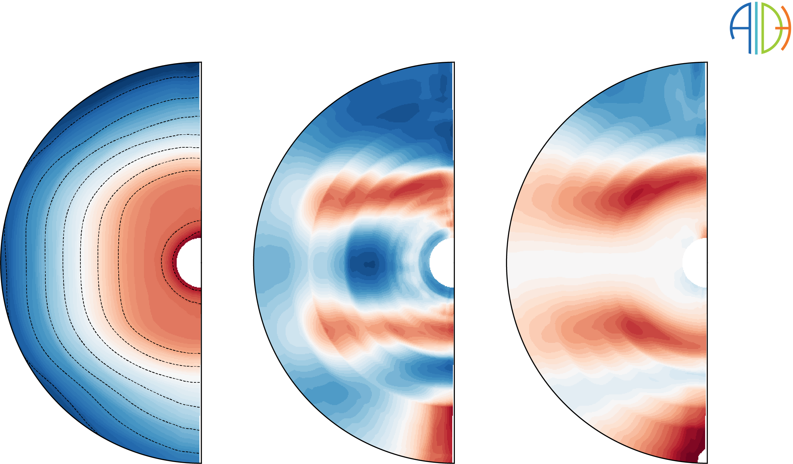

# Velocity Distribution Functions utilities

This directory contains a list of examples showing the use of tools to process, interpolate, and plot particle velocity distributions.
A particular focus is given to MMS data.

___

___

* `00_index_notebook.ipynb` introduces and links all VDF notebooks.

Notebooks 01, 02 and 03 are technical notebooks, explaining, illustrating and testing AIDApy VDF utilities.
* `01_mms_overview.ipynb` illustrates the possibilities offered by `aidapy` for handling and analysing particle Velocity Distribution Functions (VDFs) observed by the Magnetospheric MultiScale (MMS) mission.
* `02_interpolation_technical` gives technical details on the interpolation technics used by AIDApy VDF utilities (draft).
* `03_grid_geometry.ipynb` briefly presents how different geometries of grids are used by the VDF utilities.

Notebooks 04 and 05 showcase the library capacities on scientific cases.
* `04_whistler_cyclotron.ipynb` creates all electron Velocity Distribution Functions (VDF) provided in the manuscript "Resonant whistler-electron interactions: MMS observations vs. test-particle simulation".
* `05_vdf_variability.ipynb` proposes a short case-study showing characteristic electron VDFs close to the magnetopause, in the magnetosheath.
